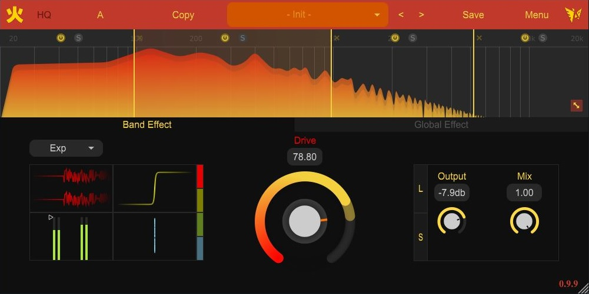

# **Analysis of the Fire plugin by jerryuhoo**
## CMLS 2023 HW2 - The Sine Of The Times

# About the plugin
The object of our analysis is the "Fire" plugin by jerryuhoo, which can be found [here](https://github.com/jerryuhoo/Fire/).

Very briefly, Fire is a multiband distortion plugin inspired by notorious effects such as [Saturn](https://www.fabfilter.com/products/saturn-2-multiband-distortion-saturation-plug-in) by FabFilter.

Knobs are divided into two groups, Band Effect and Global Effect

The user can apply different types of input-output relations, set the strength of the distortion and the amount of wet signal to send in the final chain. 
This can be done for each band separately or, by not adding any extra band, for the whole signal.

Some effects, such as a downsampler, are available in both tabs and can be used to shape the sound even further.

# Our analysis
The report of our analysis can be found in the **_report_** folder in this repository. We chose to focus only on the general structure and the most important parts of the plugin, without going into too much detail in order not to overwhelm the reader with informations (and to keep the report length contained).

# Special thanks
* jerryuhoo AKA Wings for making this plugin and for their very fast answer to our email!
